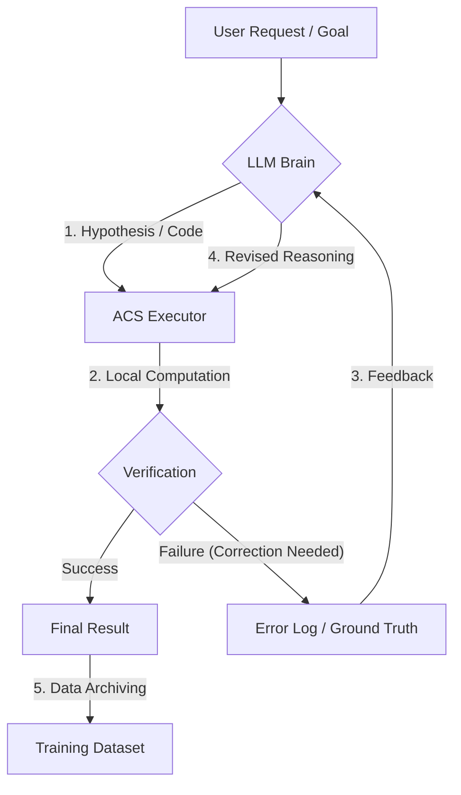

# ACS Architecture: Self-Reflection Loop

This document describes the autonomous feedback loop used to verify LLM hypotheses and refine reasoning through local computation.

## 1. Workflow Diagram

## 2. Component Roles

- **LLM Brain (Mathstral/Llama 3)**: Generates initial reasoning and verification code.
- **ACS Executor**: Executes Python code in the isolated `acs_env` environment.
- **Verification Logic**: Compares LLM output with ground truth obtained via exhaustive search or symbolic math (SymPy).
- **Self-Reflection Phase**: The model analyzes why its previous logic failed when presented with hard evidence (Counter-examples).

## 3. Data Flow
1. **Input**: A complex problem (e.g., Tokyo Tech Math).
2. **Execution**: Python search finds `[1, 2, 3, 6]`.
3. **Reflection**: Model is told: "You said 1 and 3, but I found 2 and 6. Explain the logic you missed."
4. **Learning**: The corrected logic and the discovered values are stored for future fine-tuning (DPO/Iterative SFT).
