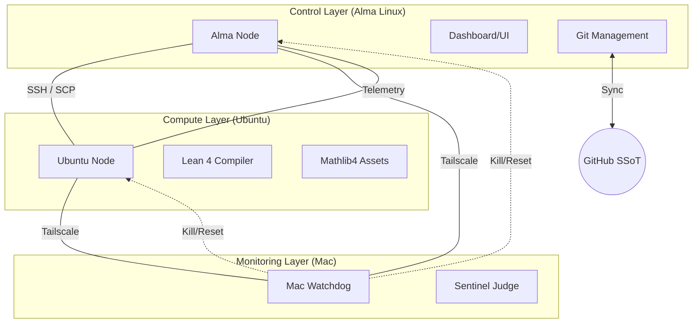

# Component 0: Infrastructure & Node Architecture

## Component Mission
To provide a resilient, distributed execution environment that separates high-intensity computation (Lean compilation) from stable control (Git/UI) and secure monitoring (Watchdog).

## Node Roles & Interactions

### 1. Alma Linux (The Control Node)
- **Status**: Main Entry Point.
- **Interactions**:
    - **Inbound**: GitHub (code pull), Ubuntu (data harvester).
    - **Outbound**: Ubuntu (SSH command trigger), GitHub (result push).
- **Failure Mode**: If Alma fails, the entire orchestration stops. The SSoT (GitHub) remains, but the automation pulse is lost.

### 2. Ubuntu (The Compute Node)
- **Status**: Worker/Slave.
- **Interactions**:
    - **Inbound**: Alma (SSH commands + SCP code transfer).
    - **Outbound**: Alma (Command output + error logs).
- **Failure Mode**: If Ubuntu fails, translation/verification stops. Alma remains healthy and provides the dashboard, but "Progress" stalls.

### 3. Mac (The Watchdog Node)
- **Status**: Independent Observer.
- **Interactions**:
    - **Inbound**: Telemetry from Alma/Ubuntu via Tailscale.
    - **Outbound**: Remote kill commands/reboot triggers.
- **Failure Mode**: Mac failure only results in loss of "High-Level Judge" monitoring. Local sentinels on Alma/Ubuntu continue to operate.

## Network Architecture
- **Layer 1**: Tailscale WireGuard overlay for encrypted inter-node communication.
- **Layer 2**: SSH (Ed25519) with strict `StrictHostKeyChecking=no` for automated script execution.
- **Layer 3**: HTTPS for Git synchronization to GitHub.

## Challenges & Outlook
- **Connectivity Latency**: Large Lean compilations over SSH can occasionally time out.
- **Outlook**: Moving toward a "Persistent Remote Agent" on Ubuntu that Alma talks to via API rather than raw SSH, improving speed and error handling.
