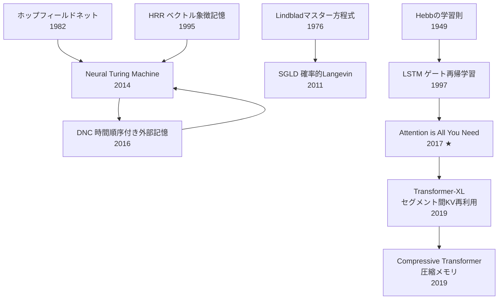
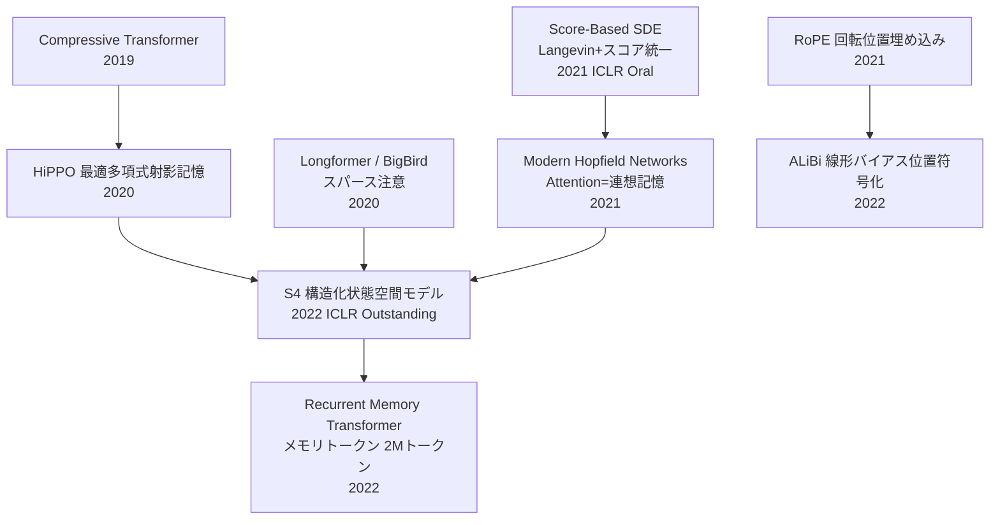
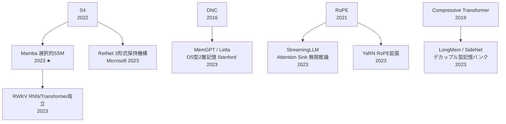
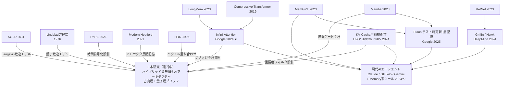

# AI記憶・コンテキスト管理技術の系譜ツリー

**作成日**: 2026-04-12

---

## 図1：基礎理論層 → Transformerの台頭（〜2019）

---

## 図2：長文・記憶への挑戦（2020〜2022）

---

## 図3：次世代高速アーキテクチャ（2023）

---

## 図4：現代AIエージェント（2024〜2025）と本研究

---

## タイムライン早見表

| 年代 | 主要論文 | 技術革新 |
|---|---|---|
| 1949 | Hebbの学習則 | 共起強化による接続重み更新 |
| 1976 | Lindbladマスター方程式 | 量子散逸の数学的記述 |
| 1982 | 古典ホップフィールドネット | エネルギー最小化・連想記憶 |
| 1995 | HRR | 固定サイズベクトル重ね合わせ記憶 |
| 1997 | LSTM | ゲートによる選択的忘却 |
| 2011 | SGLD | 確率的Langevin勾配降下 |
| 2014/16 | NTM/DNC | 外部メモリ付きニューラルネット |
| 2017 ★ | Attention is All You Need | Self-Attention・Transformer誕生 |
| 2019 | Compressive Transformer | 古い記憶の段階的圧縮 |
| 2020 | HiPPO | 多項式最適射影による記憶保持 |
| 2021 ★ | S4・RoPE・Modern Hopfield | SSM・回転位置符号化・Attention=連想記憶 |
| 2023 ★ | Mamba・MemGPT | 選択的SSM・OS型2層記憶エージェント |
| 2024 ★ | Infini-Attention・Griffin | ブリッジ型圧縮記憶・ゲート線形再帰 |
| 2025 | Titans | テスト時更新型3層記憶 |
| 進行中 | **本研究** | 古典層+量子層ハイブリッド |
