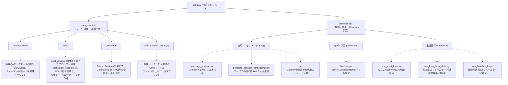
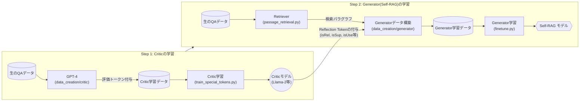
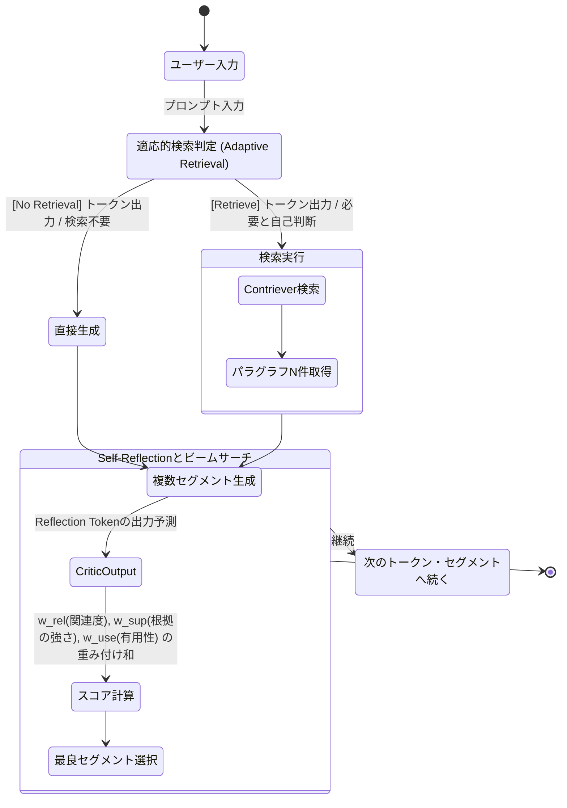

# Self-RAG アーキテクチャ解析レポート

## 1. コードツリーアーキテクチャ図 (Code Tree Architecture)

Self-RAGのリポジトリは、大きく分けて**学習データの構築とCriticモデルの訓練**を担う `data_creation/` と、**ジェネレータモデル(Self-RAG本体)の学習・推論・検索処理**を担う `retrieval_lm/` の2つの主要なディレクトリから構成されています。



### リポジトリの物理的なツリー構造要約
```text
self-rag/
├── data_creation/             # 訓練データの生成パイプライン
│   ├── critic/gpt4_reward/    # GPT-4にアノテーションをさせるスクリプト群
│   ├── generator/             # Generatorの学習データを構築するモジュール
│   ├── process_data/          # 既存データセット(KILT, ASQAなど)を読み込むモジュール
│   └── train_special_tokens.py# Criticモデルの学習用メインスクリプト
├── retrieval_lm/              # 実運用（検索・推論）およびGenerator学習パイプライン
│   ├── finetune.py            # Generatorモデルの学習スクリプト
│   ├── passage_retrieval.py   # Contrieverによるエンティティ・文書検索
│   ├── run_short_form.py      # 短文用・単発検索QA（PopQA, ARC等）の推論スクリプト
│   ├── run_long_form_static.py# 長文用（ASQA等）、適応的検索・ビームサーチの推論スクリプト
│   └── src/                   # 検索インデックス作成、Contrieverクラス実装等
├── environment.yml            # Conda環境定義
└── requirements.txt           # PIP依存関係
```

---

## 2. 提案：その他に必要なアーキテクチャ図

コード自体の配置だけでなく、「データがどう流れてモデルが構築されるか」「推論時にどのように検索と生成が行われるか」という**振る舞いや状態遷移のアーキテクチャ**を捉えることがSelf-RAGの理解には不可欠です。

そのため、以下の2つのアーキテクチャ図を追加で作成・整理することを強くおすすめします。

### 提案A: 学習データ構築・パイプラインアーキテクチャ図
Self-RAGは単なるプロンプトエンジニアリングではなく、複数段階のモデル(CriticとGenerator)の学習を前提としています。データの流れを可視化した以下の図は、論文記載の学習プロセスを理解するのに役立ちます。



### 提案B: 推論時の適応的検索とセグメント単位のビームサーチアーキテクチャ図 (Sequence / Flow Diagram)
Self-RAGの最大の強みは、「必要な時にだけ検索を呼び出し（Adaptive Retrieval）、生成された結果を自己評価して最良なセグメントを選ぶ」点です。`run_long_form_static.py` 内で実装されているこの振る舞いをフローチャート化すると全体像が把握しやすくなります。



### おすすめの活用方法
- コードの改修や実装の拡張を行う場合、**提案Aの図**を元に、どの段階のデータ処理を変更する必要があるか(GPT-4のプロンプトか、Criticの推論処理か)を特定します。
- 自己反省(Reflection)のロジックや重み(`w_rel`, `w_sup`, `w_use`)のチューニングを試みたい場合は、`run_long_form_static.py`と**提案Bの図**を照らし合わせることで、ビームサーチ内の評価基準アルゴリズムを容易に把握できます。

---

## 3. 追加解析: `retrieval_lm` および `src` ディレクトリの詳細

`retrieval_lm` 内の各種推論実行スクリプト以外の補助ファイル群と、`src/` 配下の構成についての解析と、それらが「Self-RAG システム全体」にどのような影響や役割を与えているかを評価します。

### 3.1 `retrieval_lm/` のその他のファイルと役割
各推論スクリプト（`run_***.py`）を根底から支えるためのデータ整形・評価指標計算・最適化処理が置かれています。

- **`utils.py`**:
  Reflection token（`[Relevant]`, `[Fully supported]`, `[Utility:1~5]` 等）のIDマッピングや、プロンプトのフォーマット（ARC, ASQA, FactScoreなどのタスク別成形）、推論結果の出力後処理（事前定義トークンのパース・除去）を行います。
- **`metrics.py`**:
  生成結果に対する Exact Match 評価、Accuracy、F1スコアの計算を担います。ベンチマーク回答の正解ラベルとの文字列の一致度を検証するために正規化処理も行います。
- **`llama_flash_attn_monkey_patch.py`**:
  Llama 2 モデルの Self-Attention 処理を **[FlashAttention](https://github.com/Dao-AILab/flash-attention)** に差し替える（モンキーパッチ）スクリプトです。コンテキスト長（文脈）の計算効率を劇的に向上させます。
- **各種シェルスクリプトや `.conf`**:
  (`download_demo_corpus.sh`, `script_finetune_*.sh`, `stage3_no_offloading_accelerate.conf` など)。モデルの分散学習（DeepSpeed / Accelerate）やデモ用コーパスのダウンロード自動化などに使われます。

### 3.2 `retrieval_lm/src/` の構成と役割
`src` ディレクトリは主に **検索エンジン（Retriever）のバックエンド処理** に特化したモジュール群であり、基本的には Meta (Facebook) が開発したベクトル検索モデルである **Contriever** の実装をフォーク・統合したものです。

- **`contriever.py`, `moco.py`, `inbatch.py`**: BERT や XLM-RoBERTa をベースとした Contriever モデルの本体クラスファイルです。対照学習（Contrastive Learning: MoCo等）を利用したエンコーダの構造を持ちます。
- **`index.py`**: FAISS（Meta開発の高速近似近傍探索ライブラリ）のラッパー関数です。`faiss.IndexPQ` などを利用して、巨大なドキュメントコーパスからクエリと類似するベクトルを瞬時に見つけ出します。
- **`data.py`, `finetuning_data.py`, `beir_utils.py`**: 検索精度を学習させるためのデータローダーと、BEIR（多様な情報検索のベンチマーク）に合わせた処理を行います。
- **`utils.py`, `dist_utils.py`, `options.py`**: 最適化関数（AdamW、Cosine Scheduler）、分散処理バリア、モデルチェックポイントの保存などを担う深層学習の学習ループ汎用ライブラリです。

### 3.3 リポジトリ全体への影響能力の評価
これらのファイル群は、Self-RAG リポジトリ全体において**「スケーラビリティ」「拡張性」「モジュール性」**という観点で多大な影響と役割を果たしています。

1. **推論と文脈理解の極限までのスケーラビリティ担保 (`llama_flash_attn_monkey_patch.py`)**
   Self-RAGの特徴は「必要な時に何度も検索を行い、パラグラフをコンテキストに挿入する」ことです。この性質上、通常のRAG以上にLLMへ入力される文章長（シーケンス長）が爆発的に伸びます。FlashAttention パッチが存在することでメモリOOMを回避しており、文字通り**システムを動作させるための生命線**となっています。

2. **検索バックエンドの疎結合化とモジュール性の確保 (`src/` 構成)**
   `retrieval_lm/` の推論コードは、生成（Generator）と批判（Critic）の複雑な制御に注力し、純粋な「ベクトル検索と類似度計算」業務はすべて `src/` (Contriever と FAISS) へ完全に委譲しています。このアーキテクチャのおかげで、もし将来的に **Contriever から別の高性能な Embedding モデル (BGE や OpenAI Embeddings) に差し替えたい場合でも、`src/` 内を変更・拡張するだけでシステム全体が成立する** 高い拡張性を有しています。

3. **統一的な特殊トークン制御 (`utils.py`)**
   Reflection Token は Self-RAG の中核ですが、それを各タスク間でハードコーディングせず、`utils.py` にマッピング処理を集約させていることは、コードの保守性と堅牢性を底上げしています。

これら周辺機能が存在することで、プロンプトの工夫だけに留まらない、実用的な機械学習パイプラインとして成立させています。
