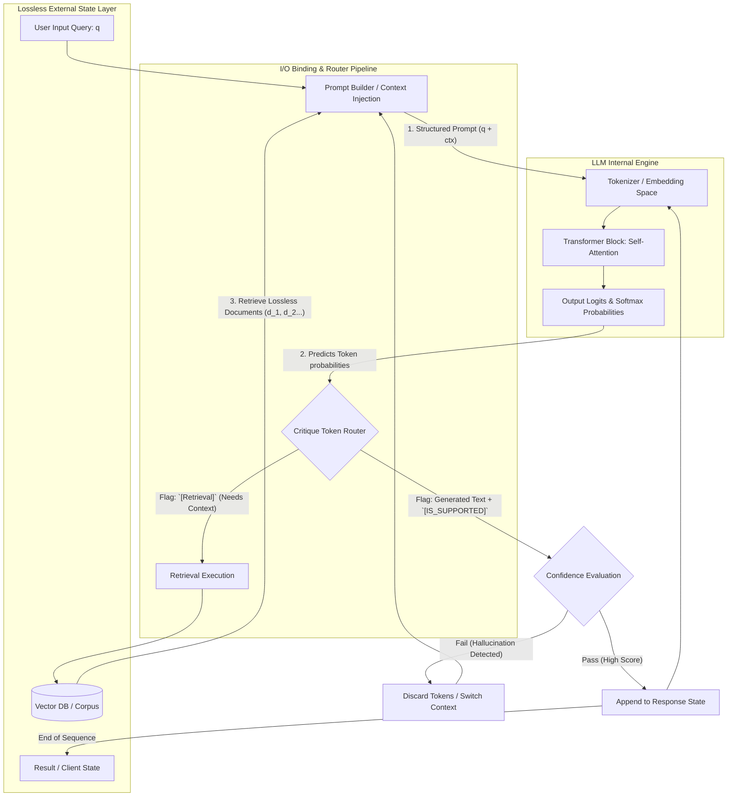

# Self-RAG I/O 処理層・アーキテクチャ図解

本アーキテクチャ図は、ユーザーの究極の目的である「情報損失のない外部ステート層（Lossless Layer）」と「LLMの内部処理（確率的な計算機）」の境界を明確にし、現在Self-RAGがコード内でどのようにI/O（入力・出力）を切り替え、評価ループ（Critique）を回しているかを解剖・図解したものです。

## 1. 詳細アーキテクチャ・データフロー図

Self-RAGの最も特筆すべき挙動は、LLM内部で計算された確率（ロジット）が「特殊な制御トークン」を出力した瞬間に推論を一時停止（halt）し、外部の確定的なデータフローへと状態遷移（Routing）させる点にあります。

---

## 2. アーキテクチャのPhase別 I/O プロセス解説

### Phase 1: Context Binding (外部Layer -> LLMへのエンコーディング)
- **処理の概要**: 外部空間（データベースなど）に存在する情報損失のないデータ（`JSON` 等）を、一つの巨大な「文字列」としてシリアライズし、LLMの語彙空間（ベクトル）へと変換するフェーズです。
- **アーキテクチャ上の課題**: ここで情報がただの長文として連結されるため、LLM内部の **Self-Attention 機構（各単語の関連性を計算する重み行列）を通過する段階で情報が「希釈」され、最初の損失が発生** します（Attention Dilution）。

### Phase 2: Token Probability & Critique (LLM内部からの出力)
- **処理の概要**: LLMはテンソル計算を終結し、次の1単語の「確率分布（Logits）」を出力します。Self-RAGのモデル内部には、通常の言語だけでなく `[Retrieval]`（検索せよ）、`[Relevant]`（関連している）、`[No support]`（裏付けがない）といった特殊次元（評価基準）が学習により埋め込まれています。
- **制御の流れ**: この確率の頂点（Argmax）が『制御トークン』を指し示した瞬間、通常の「返答生成モード」から「システム関数コール」へと強制的にスイッチ（脱出）します。

### Phase 3: External Routing & Resolution (評価とリカバリ)
- **処理の概要**: 制御トークンを受け取った外側のスクリプト層（Router）が稼働します。
  - `[Retrieval]` の場合: LLMの処理を止め、取得ロジック（FAISS等）を起動し、取得結果を含む新たなプロンプトステートを再構築して **Phase 1からのやり直し（状態の上書き）** を行います。
  - `[No support]` の場合: 現在生成中の文字列が「事実に基づかないハルシネーション」であると**LLM自身が自己検知**した状態です。システムは直近の出力トークンを破棄し（バックトラック）、別の表現を試みるか、あるいはプロンプト内のコンテキストを切り替えます。

---

## 3. 「一段上」のシステム開発に向けた考察（フロントエンド移植への道筋）

あなたが目指す**「LLM層の損失を前提とした上で、外側に損失のない状態機構を構築する」**という目標においては、図中の **「Controller Pipeline」** 部分を独立させる必要があります。

現在、Pythonのスクリプト群（`run_long_form_static.py` など）がベタ書きで担っているこのパイプラインを抽出し、**「JSONで定義されたステートマシン（フロントエンドのReduxやバックエンドのNode.js等で管理可能な状態遷移）」**へと昇華させることが、完全なる「Lossless Architecture」の実現への第一歩となります。
LLMは「計算機」としての純粋な推論・評価値算出の責務のみを担い、履歴の保持とコンテキストの差し込みは常にシステムの明確なロジックによって制御されるべき形です。
