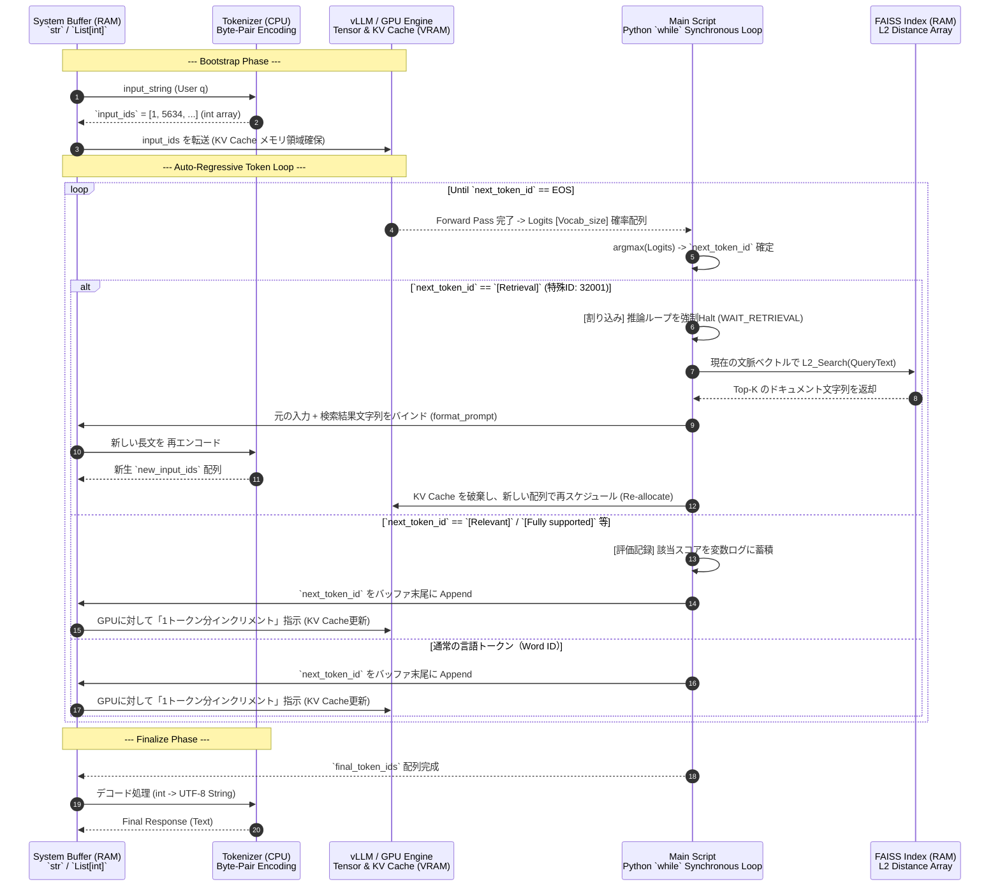
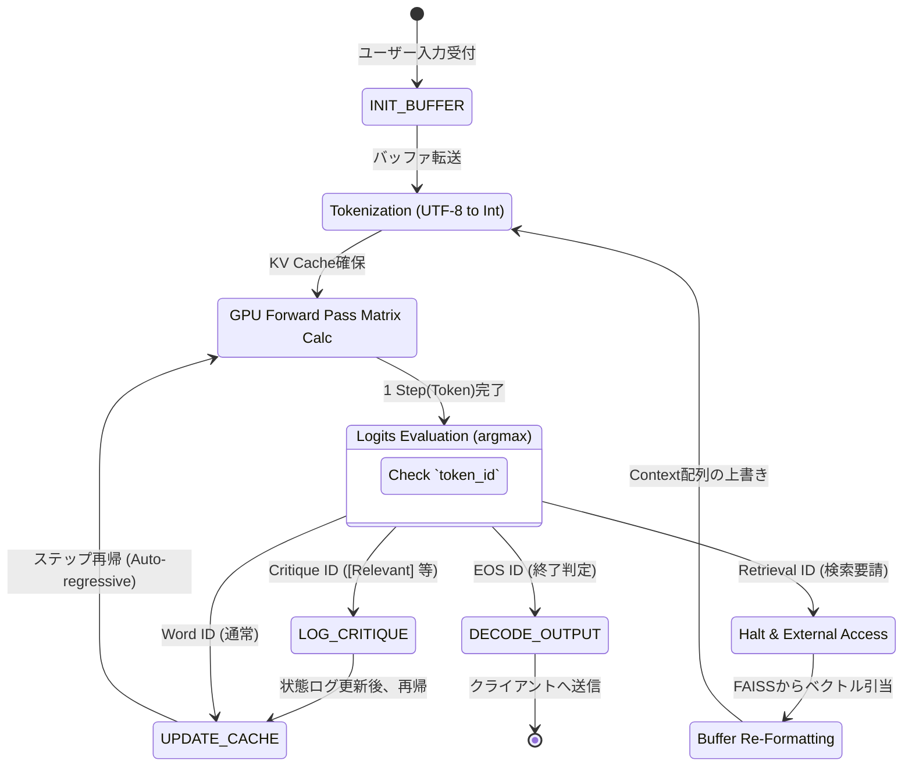

# Self-RAG Low-Level アーキテクチャ図解 (System & Memory Layer)

先ほどの構成図は「意味的なデータの流れ（High-level）」に寄りすぎていました。
ここではシステムエンジニア・組込（ECU）の視点に落とし込み、**「どのメモリ（RAM/VRAM）に何が格納され、どこで同期待ち（ブロッキング）が発生し、状態（ステート）がどう遷移するか」**という、実コード（Low-level）のシーケンスとステートマシンとして描き直しました。

---

## 1. Low-level シーケンスダイアグラム (関数とメモリのやり取り)

LLMの推論の本質は、「文字列」ではなく「整数配列（`List[int]`）」の操作と、GPU上のKVキャッシュメモリへの連続的な書き込みに過ぎません。外部通信（RAG）は、この同期的なWhileループへの割り込み（Interrupt / Halt）として実装されています。

### Low-level 視点での重要ポイント
- **情報は完全にステートレス**: LLM自体（Engine）は過去の「記憶」を一切持ちません。全ては毎ターン更新される `KV Cache` という行列メモリと、常にSystem Buffer（RAM）側で管理されている `input_ids` の配列状態に依存しています。
- **検索の正体は「コンテキストの再構築（破壊的変更）」**: `[Retrieval]` が発生すると、GPU側の計算を一度捨ててでも、System Buffer（State）側で配列構造を組み直し、再度GPUに流し込んでいることがわかります。

---

## 2. 実装移植用 状態遷移マシン（State Flow）

フロントエンド（React / TypeScript）やバックエンド（Node.js / Rust）へ移植し、情報損失を完全にコントロールする層を作る場合、構築すべき状態遷移（ステートマシン）は以下の設計となります。

### なぜこれが入出力制御（損失制御）の最適化に繋がるのか？
- このLow-levelなフローから見えてくるのは、**「いつ、どのタイミングで、どの情報をバッファ（Buffer）に混ぜるか・捨てるか」**という主導権は、完全に外側の `Router (State Machine)` 側にあるという事実です。
- LLMの内部アルゴリズムには手を加えずとも、この外側の状態遷移マシンを「厳格に型付け・制御する」だけで、LLMに不要な情報を削ぎ落とし、本当に評価してほしいベクトルだけを注入する（損失を最適化する）ことが可能になる構造です。
