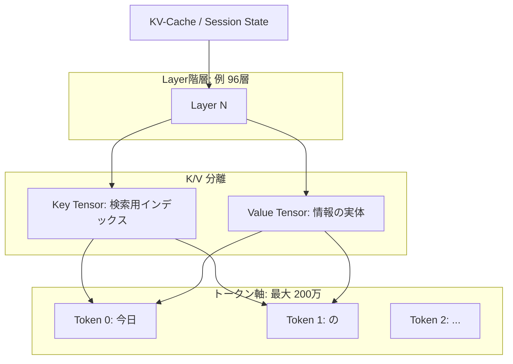

# アーキテクチャ図：商用 LLM の KV キャッシュ構造


商用 LLM の巨大なコンテキストウィンドウを支える「記憶のデータユニット」の階層構造と、アクセスロジックを可視化する。

---

## 1. データの階層構造 (Hierarchy)

KV キャッシュは、以下の入れ子構造（テンソル）として GPU メモリ上に展開される。

### ASCII 構造イメージ
```text
[KV-Cache / Session State]
   │
   ▼
[Layer 0] ── [Layer 1] ── ... ── [Layer 96]
   │
   ├─ [Key Tensor (検索用)] ────▶ [Token 0] [Token 1] [Token 2] ...
   │                              (今日)   (の)     (朝食)
   │
   └─ [Value Tensor (実体)] ───▶ [Token 0] [Token 1] [Token 2] ...
                                  (意味)   (関係)   (詳細)
```

### Mermaid Diagram (レンダリング用)


---

## 2. 論理と物理の分離 (Logical vs Physical)

商用システムでは、この巨大なデータを管理するために「台帳」と「実体」を分けて管理している（PagedAttention など）。

| レイヤー | 形式 | 役割 | 課題 |
| :--- | :--- | :--- | :--- |
| **論理レイヤー (Metadata)** | **JSON / Index** | どのトークンがどのメモリアドレスにあるかを管理。 | 100万トークンを超えると台帳自体が巨大化。 |
| **物理レイヤー (Storage)** | **Binary (FP16/FP8)** | GPU VRAM 上に並ぶ生のベクトルデータ。 | 容量がテラバイト級に達し、転送速度がボトルネックになる。 |

---

## 3. 私たちの「物理流テンソル」との比較

| 特徴 | 商用 KV キャッシュ | 物理流テンソル (提案) |
| :--- | :--- | :--- |
| **構成単位** | **トークンごとの点（離散）** | **意味の塊（スロット/パケット）** |
| **時間変化** | 静的（一度書いたら不変） | **動的（慣性を持って変化する）** |
| **容量効率** | トークン数に比例して増大 (O(N)) | **定数サイズで一定 (O(1))** |

### 結論
商用モデルのキャッシュ構造は「巨大な図書館の棚」のようなもので、棚が増えるほど管理が困難になります。対して私たちが目指すのは、**「情報の要点をうねりとして保持する流体」** であり、棚（スロット）を構造化しつつも、物理的な法則で自動的に整理される仕組みです。
