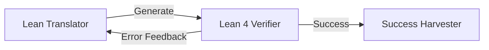
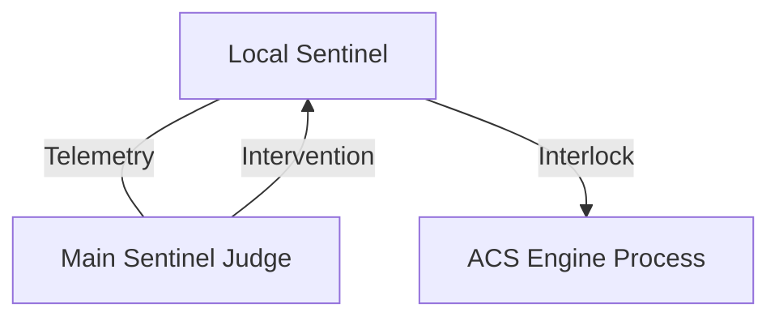
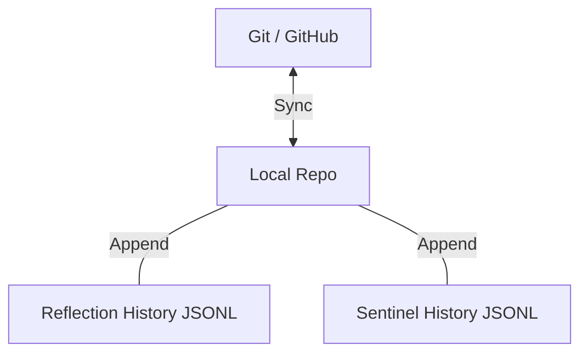
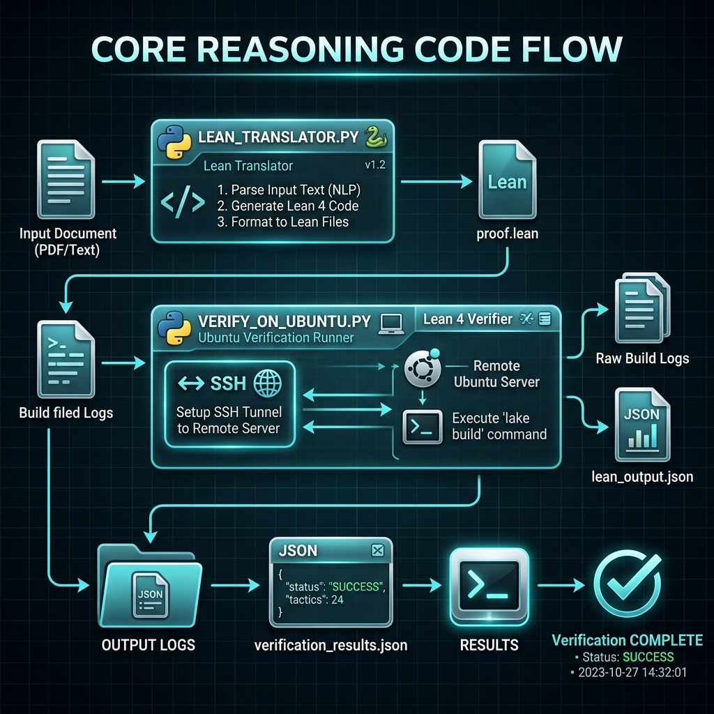
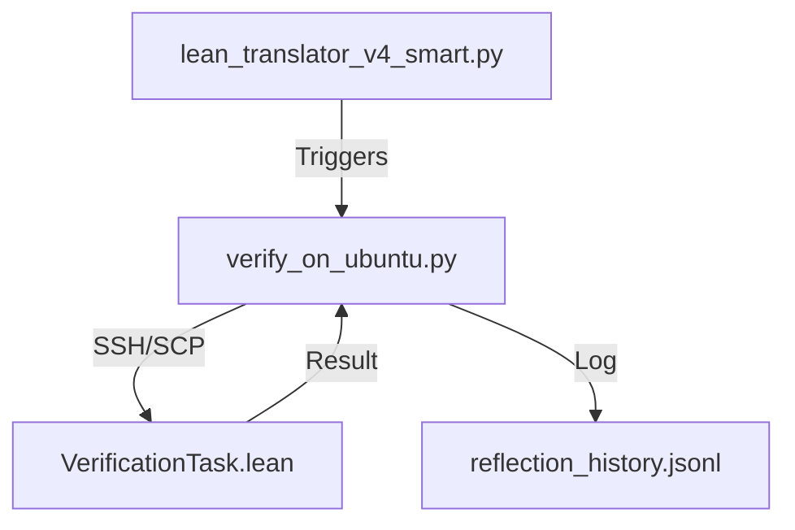
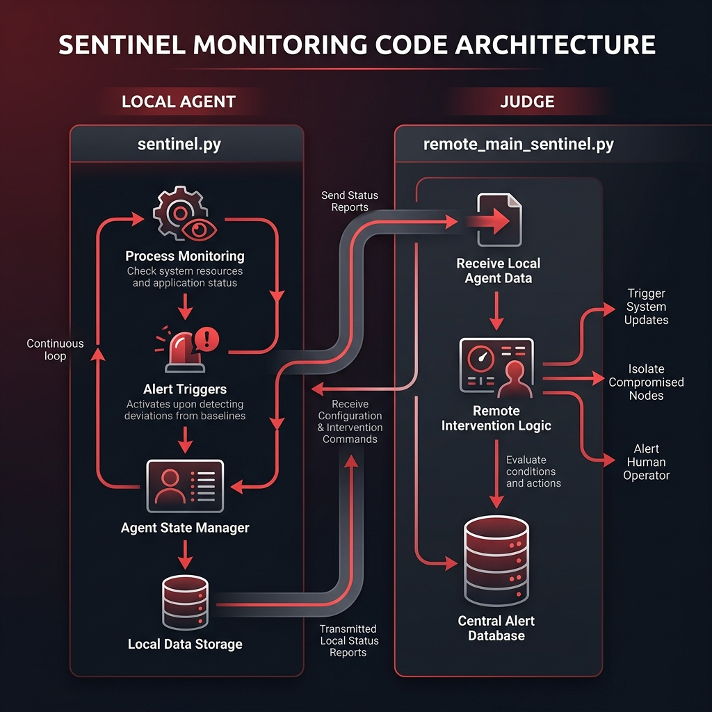
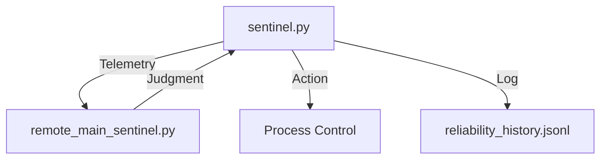

# Architecture Gallery: Sentinel-Leanstral

This gallery provides detailed visual and technical breakdowns of the system's architecture, separated by functional components and code logic.

---

## 1. ACS Engine (Component Architecture)
The brain of the system, responsible for mathematical reasoning and formal verification.

---

## 2. Sentinel Monitoring (Component Architecture)
The immune system, ensuring safety and resource optimization through proactive intervention.

---

## 3. Knowledge & State (Component Architecture)
The memory of the system, maintaining a synchronized Single Source of Truth (SSoT).

---

## 4. Core Reasoning (Code Architecture)
Logic flow between scripts responsible for problem ingestion and proof generation.

---

## 5. Sentinel System (Code Architecture)
Interaction between local monitoring agents and the central judge logic.

